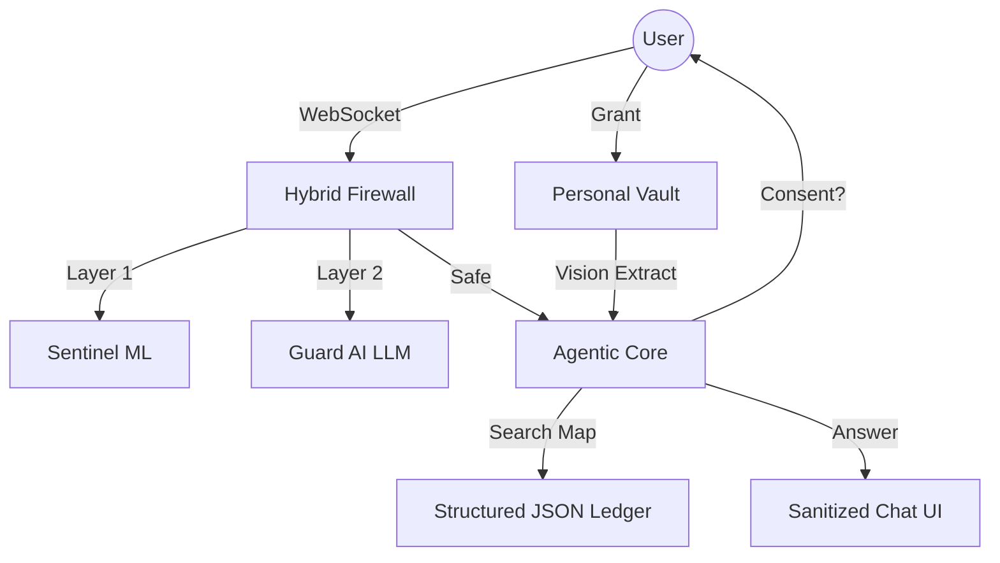

# 🛡️ BureacyBuster: Zero-Trust Document Intelligence

**BureacyBuster** is a high-fidelity, production-ready AI platform designed to transform chaotic document workflows into structured, secure, and actionable intelligence. Built for high-stakes environments, it combines **Vectorless Indexing**, a **Hybrid Two-Layer Firewall**, and **Vision-Powered Agentic Retrieval** to ensure total data privacy without compromising on intelligence.


---

## 🚀 Key Features

### 🛡️ Two-Layer Hybrid Firewall
Maximum protection against Prompt Injection and adversarial attacks.
- **Layer 1 (Sentinel ML)**: A high-speed local Random Forest classifier that pre-scans every query.
- **Layer 2 (Guard AI Audit)**: Suspicious queries are escalated to a specialized Security LLM for deep intent analysis.
- **Infrastructure Safety**: Automatically blocks any intent that triggers cloud-level content filter violations.

### 🧠 Vectorless Agentic Indexing
Privacy-first intelligence that doesn't rely on vulnerable vector databases.
- **Micro-Structured JSON Ledger**: Ingests legal documents into a highly organized header/subheading map.
- **Vision-Powered Drill-Down**: The AI "looks" at the document map and chooses which specific paragraphs to retrieve using vision extraction.
- **Zero Embedding Risks**: Eliminates the risk of vector leakage and semantic hallucinations.

### 🔒 Secure Personal Vault (Consent Handshake)
- **Zero-Trust Access**: The Agent is strictly forbidden from accessing personal identity documents (Passports, Citizenship Cards) by default.
- **Linguistic Handshake**: The AI must explicitly ask for user permission. Only upon verified user consent is the `Vision Retrieval` tool unlocked for a single transaction.

### 📊 Professional Progress UI
- **Full-Page Overlay**: High-fidelity, animated progress tracking for legal batch indexing.
- **Real-Time Polling**: Tracks page-by-page transcription status using a dedicated progress API.

---

## 🛠️ Technology Stack

| Layer | Technologies |
| :--- | :--- |
| **Backend** | Python 3.10+, FastAPI, Uvicorn, AsyncOpenAI |
| **Frontend** | Vite, React 18, Tailwind CSS, Lucide Icons, Framer Motion |
| **Intelligence** | Azure OpenAI (GPT-4o Vision & Text), Scikit-Learn (RandomForest) |
| **Database** | MongoDB (Structured Storage), ODMantic ORM |

---

## 🗺️ System Architecture



---

## 📦 Installation & Setup

### 1. Backend Setup
```bash
cd backend
python -m venv venv
source venv/bin/activate
pip install -r requirements.txt
python scripts/train_firewall.py  # Initialize the Security Layer
python main.py
```

### 2. Frontend Setup
```bash
cd frontend
npm install
npm run dev
```

### 3. Environment Variables
Create a `.env` in the `backend` folder:
```env
AZURE_OPENAI_API_KEY=your_key
AZURE_OPENAI_ENDPOINT=your_endpoint
AZURE_OPENAI_DEPLOYMENT_NAME=your_model
MONGODB_URL=mongodb://localhost:27017
```

---

## 📜 Documentation
For more detailed technical insights:
- [API_DOCUMENTATION.md](API_DOCUMENTATION.md)
- [WORKFLOW.md](WORKFLOW.md)

---

## 🛡️ Security Disclaimer
This project is built for the **Neural-Ninjaz Hackathon**. It implements advanced security protocols but should undergo full audit before production use.

Built with ❤️ by **Neural Ninjaz Team**.
